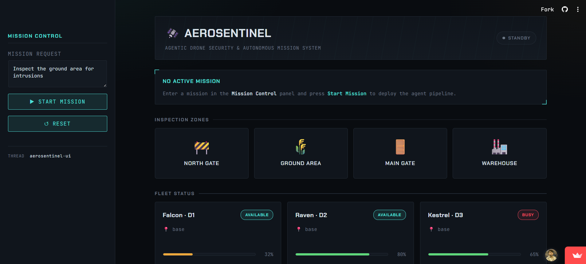
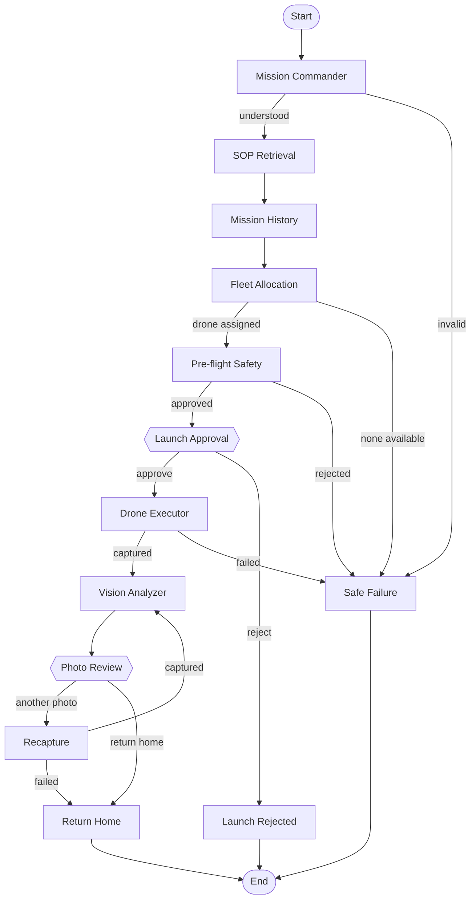

# AeroSentinel

**AeroSentinel is an agentic drone security platform for supervised autonomous missions.**

It turns a natural-language security request into a structured mission, grounds decisions in operational procedures, assigns a simulated drone, and keeps a human operator in control at every consequential step.

## Live Demo

<a href="https://aerosentinelapp.streamlit.app/" target="_blank" rel="noopener noreferrer">
    
</a>

Open the [AeroSentinel live demo](https://aerosentinelapp.streamlit.app/) to try the mission console in a new browser tab.

## What It Does

An operator can enter a request such as:

> Inspect the ground area for intrusions

AeroSentinel then:

1. Interprets the request as a mission type, location, and priority.
2. Retrieves relevant security SOPs from the local ChromaDB knowledge base.
3. Loads mission history for the requested location.
4. Selects an available drone based on fleet state and battery.
5. Runs pre-flight checks for battery, altitude, and geofence rules.
6. Pauses for operator approval before launch.
7. Simulates takeoff, navigation, and image capture.
8. Sends the captured image to a Groq vision-language model for analysis.
9. Pauses after every image so the operator can request another angle or return home.
10. Records the mission, photo assessments, and operator decision to JSON-backed memory.
11. Routes failures to a clear rejection or safe return instead of crashing the application.

## Human-In-The-Loop Checkpoints

Both checkpoints are real LangGraph `interrupt()` calls. The graph state is checkpointed and resumes from the paused node when the operator responds.

| Checkpoint | When it occurs | Operator decision |
| --- | --- | --- |
| Launch approval | After fleet allocation and pre-flight safety checks | Approve launch or keep the drone grounded |
| Photo review | After each image is captured and analyzed | Capture another image or return home |

Requesting another image keeps the drone in flight and advances to the next numbered image in the same zone. A new launch is not required.

## Architecture



## Technology

| Layer | Technology |
| --- | --- |
| Orchestration | LangGraph with checkpointed interrupts |
| Text and vision models | Groq API using `qwen/qwen3.6-27b` |
| Retrieval | ChromaDB and `sentence-transformers/all-MiniLM-L6-v2` |
| Frontend | Streamlit |
| Drone simulation | Custom `MockDrone` and `DroneFleet` classes |
| Mission memory | JSON-backed mission log |

## Project Layout

```text
AeroSentinel/
├── app.py                  # Streamlit mission console
├── agents/                 # Commander, RAG, memory, fleet, safety, drone, and vision agents
├── graph/                  # MissionState and the LangGraph workflow
├── simulator/              # MockDrone and DroneFleet implementations
├── rag/
│   ├── rag_engine.py       # Embedding and ChromaDB wrapper
│   └── documents/          # Battery, emergency, mission, and perimeter SOPs
├── memory/                 # JSON-backed mission history
├── images/                 # Simulated camera-feed images by location
├── requirements.txt
└── LICENCE                 # MIT License
```

## Getting Started

### 1. Create and activate a virtual environment

PowerShell:

```powershell
python -m venv .venv
.\.venv\Scripts\Activate.ps1
```

### 2. Install dependencies

```powershell
pip install -r requirements.txt
```

The first RAG startup may download the local sentence-transformer model. The vision workflow also requires access to the Groq API.

### 3. Configure Groq

Create a `.env` file in the project root:

```env
GROQ_API_KEY=your_primary_key_here

# Optional fallback keys for rate limits or transient API failures.
GROQ_API_KEY_2=your_backup_key_here
GROQ_API_KEY_3=another_backup_key_here
```

Never commit `.env` or expose API keys in source control.

### 4. Add simulated camera images

Each supported inspection zone uses sequentially numbered images. At minimum, add `1.png` to the relevant folder:

```text
images/
├── ground_area/1.png
├── main_gate/1.png
├── north_gate/1.png
└── warehouse/1.png
```

`.png`, `.jpg`, and `.jpeg` are supported. Additional files such as `2.png` and `3.png` become available through the photo-review recapture flow. Images are resized and compressed before being sent to the vision model.

### 5. Run the console

```powershell
streamlit run app.py
```

## Simulated Fleet

The application starts with three simulated drones:

| Drone | Callsign | Starting battery | Starting status |
| --- | --- | ---: | --- |
| D1 | Falcon | 32% | Available |
| D2 | Raven | 87% | Available |
| D3 | Kestrel | 65% | Busy |

Battery is consumed during takeoff, navigation, and return. Drones can be manually charged from the UI while at base. If no drone is available, the mission reports the state of each drone rather than returning a generic error.


## License

AeroSentinel is released under the [MIT License](LICENCE).
